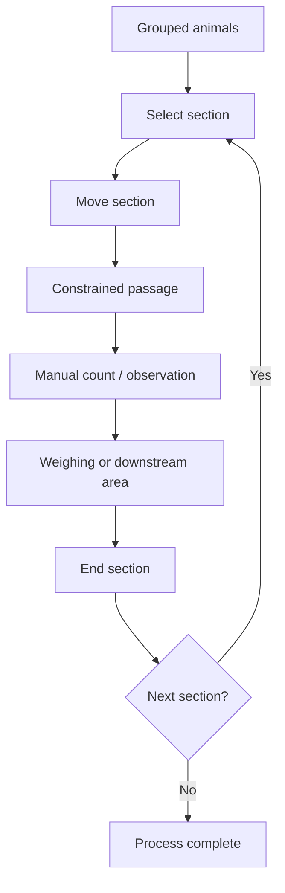
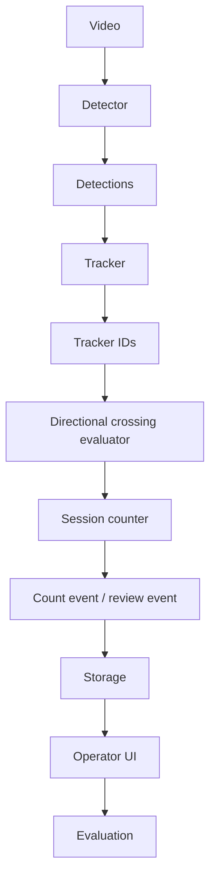
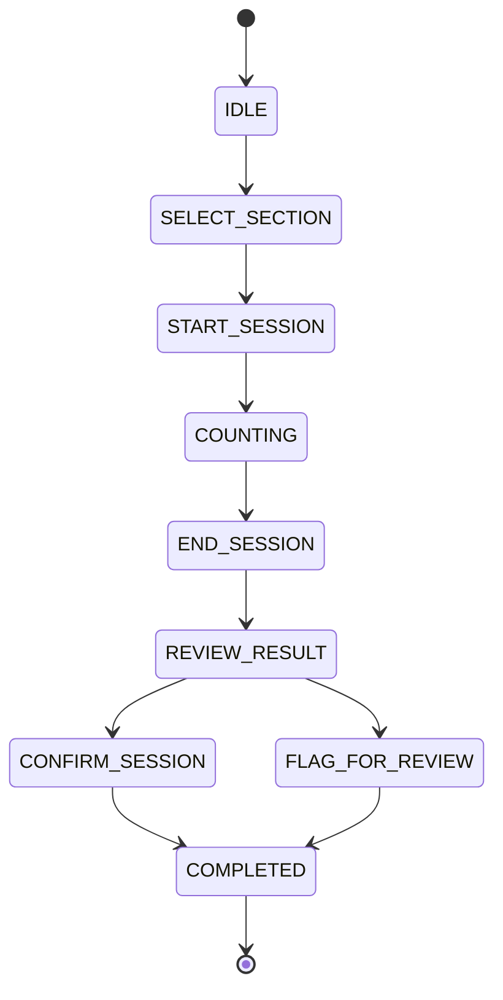

# HogFlow Conceptual Process Map

## Diagram 1 — Current conceptual workflow

Conceptual process only — facility-level workflow requires validation.

## Diagram 2 — Proposed HogFlow technical flow

The following technical flow is PLANNED and not yet implemented.

## Diagram 3 — Session state flow

Automatic section detection is not part of the initial MVP.

## Process ownership table

| Process step | Human role | HogFlow proposed role | Current status |
| --- | --- | --- | --- |
| section selection | Select which section moves next | None beyond session context intake | Human / conceptual workflow |
| session start | Start the active section session | Initialize session-scoped counting state | PLANNED |
| pig detection | None directly during AI inference | Detect candidate pigs in frames | PLANNED |
| track association | None directly during AI inference | Associate detections across frames with tracker IDs | PLANNED |
| crossing evaluation | None directly during AI inference | Evaluate directional line-crossing behavior | PLANNED |
| positive count update | Review displayed count outcome | Increment one positive count for an eligible unique crossing | PLANNED |
| reverse event recording | Review unusual movement if needed | Record reverse-direction crossing events | PLANNED |
| session end | End the active section session | Stop active counting for the section | PLANNED |
| result review | Review session result | Present AI count and review indicators | Future evaluation |
| ground-truth comparison | Provide or verify ground-truth count | Support evaluation against stored AI count | Future evaluation |
