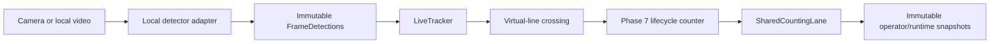

# Phase 10.2 — Pig Detector Integration and Model Runtime Boundary

## Status

Technical detector-integration infrastructure is implemented. Representative
pig detection, tracking, crossing, and counting validation remain pending.
This phase does not establish production readiness or detector accuracy.

## Objective and scope

Phase 10.2 connects one explicitly configured local detection artifact to the
existing one-source, one-worker, serial shared-lane pipeline:



The detector classifies boxes only. It does not track, detect crossings,
count, own sessions, access presentation code, retain frames, or mutate Phase
7/8 state. Training, dataset creation, labeling, model download, accuracy
measurement, persistence, and Phase 10.3 are outside scope.

## Public detector configuration

`PigDetectorConfiguration` is frozen, slotted, validated, and independent from
Ultralytics. It supports:

- explicit `empty` or local-model backend selection;
- one explicit existing local `.pt`, `.onnx`, or `.engine` artifact;
- optional local JSON provenance;
- target class name and optional sorted target class IDs;
- confidence and IoU thresholds in `(0, 1]`;
- positive inference image size and maximum detections;
- `auto`, `cpu`, `cuda`, or `cuda:<index>` device selection;
- explicit half precision;
- a deterministic configuration fingerprint that contains no path.

The artifact path and provenance path are intentionally excluded from the
dataclass representation and configuration fingerprint. The adapter computes
the artifact SHA-256 once during each controlled load lifecycle; it never
rehashes per frame.

## Artifact and provenance policy

Model weights are local runtime inputs. They are not repository assets.
`.gitignore` covers `.pt`, `.pth`, `.onnx`, `.engine`, `.ckpt`,
`.safetensors`, `data/models/**`, `/models/**`, and `/weights/**`.

`DetectorModelProvenance` exposes only:

- backend family and model format;
- fingerprint-derived sanitized model name;
- artifact SHA-256;
- configured target class and resolved target IDs;
- load timestamp;
- resolved runtime device;
- configuration fingerprint;
- installed framework version;
- whether complete training/evaluation provenance was supplied.

It never exposes the local model path. Existing `ModelArtifactMetadata`
continues to expose only a basename, never an absolute path, for Phase 5.2
compatibility.

## Adapter boundary and installed API

The existing `UltralyticsLiveDetector` remains the sole live Ultralytics
adapter. Framework imports remain lazy inside that module. The installed
validation environment used Ultralytics `8.4.114`; its `YOLO.predict` API
accepts `conf`, `iou`, `imgsz`, `device`, `half`, `max_det`, `classes`,
`save`, `stream`, and `verbose` through keyword arguments.

The adapter:

1. validates configuration and artifact format before composition;
2. lazily imports the framework runtime;
3. deterministically resolves `auto` to `cuda:0` when CUDA is available,
   otherwise `cpu`;
4. rejects an unavailable explicit CUDA index;
5. rejects half precision on CPU and TensorRT artifacts without CUDA;
6. hashes and loads the artifact once;
7. validates the complete class map without silent ID/name overwrite;
8. resolves only the explicitly configured pig target class;
9. performs one serial inference per submitted frame;
10. converts one result container into immutable HogFlow detections;
11. filters non-target classes and enforces the configured output limit;
12. closes owned backend resources when supported.

Ultralytics results, Torch tensors, NumPy arrays, OpenCV matrices, and
CUDA-specific values never cross the adapter boundary.

## Error and lifecycle policy

| Category | Domain error/policy | Pipeline behavior |
| --- | --- | --- |
| Invalid configuration | `DetectorConfigurationError` | Rejected before camera composition where feasible. |
| Missing artifact | `ModelArtifactMissingError` | Fail fast; message contains no path. |
| Unsupported format | `UnsupportedModelFormatError` | Fail fast. |
| Load failure | `DetectorLoadError` | Fatal pipeline failure; resources close. |
| Unsupported device/precision | `UnsupportedDetectorDeviceError` | Fatal startup failure. |
| Invalid frame input | `InvalidDetectorInputError` | Rejected; no detection/crossing/count is fabricated. |
| Backend timeout | `TemporaryInferenceError` | Current frame is skipped; serial worker may continue. |
| Other backend inference failure | `FatalInferenceError` | Pipeline fails safely. |
| Malformed result/box/score/class | `MalformedDetectorOutputError` | Fatal; malformed evidence cannot continue downstream. |
| Class-map conflict | `InvalidClassMappingError` | Load rejected without silent overwrite. |
| Infer before load / invalid close state | `DetectorLifecycleError` | Explicit lifecycle failure. |

The conservative policy treats only an explicit `TemporaryInferenceError` or
backend `TimeoutError` as recoverable. Arbitrary backend exceptions are fatal
because HogFlow cannot prove that framework state remains trustworthy.

## Pipeline composition and restart

`hogflow.adapters.live_detector_factory` is the infrastructure-only factory for
one detector/tracker pair. The composition root remains framework-neutral:

- empty mode creates `EmptyDetector` plus `EmptyTracker`;
- local-model mode creates one `UltralyticsLiveDetector` plus the existing
  Supervision ByteTrack adapter;
- the processor factory creates one fresh pair per pipeline lifecycle;
- each detector loads once when its processor starts and closes once when the
  run stops;
- an explicit pipeline restart creates a fresh detector/tracker lifecycle;
- reconnect reset clears tracker/crossing state but does not reload the model;
- no queue, worker, camera, counter, or async task was added.

Configuration and artifact existence/format validation occur before camera
composition. Backend loading remains in the existing worker lifecycle, after
the configured source opens, so source and model cleanup continue to use the
established Phase 9.3 shutdown path.

## CLI

The operator entry point remains empty by default. A local model is opt-in:

```text
hogflow run --video data/raw/local-input.mp4 \
  --detector ultralytics \
  --model-path data/models/pig-detector.pt \
  --target-class-name pig \
  --target-class-id 0 \
  --confidence-threshold 0.4 \
  --iou-threshold 0.5 \
  --inference-size 640 \
  --device auto \
  --max-detections 300
```

The example paths are repository-relative ignored local inputs, not committed
artifacts. `--help` does not open a source or import the framework runtime.
Detector-specific options are rejected in empty mode. No download occurs.

The Phase 5.2 technical CLI uses the same configuration model and adds
`--target-class-name`, `--max-detections`, and `--half-precision` while
preserving its existing `yolo` compatibility option.

## Bounded detector telemetry

`DetectorRuntimeTelemetry` retains scalar aggregates only:

- configured backend, format, model loaded/closed state, sanitized identity,
  resolved device, target IDs, and configuration fingerprint;
- inference attempts and successes;
- temporary, fatal, and malformed-output failures;
- detections produced and frames with detections;
- first, average, and maximum inference latency;
- last successful inference time and model load time.

`CountingPipelineSnapshot.detector` exposes the immutable projection. Existing
pipeline detector-failure counters continue feeding Phase 10.1 diagnostics and
health issue classification. There is no per-frame result, image, box, tensor,
exception, or heartbeat history.

## UI/UX impact

No operator control, screen, warning panel, or visual hierarchy changed. The
CLI and immutable application snapshot are sufficient for this integration
phase, so `ui-ux-pro-max` was not invoked. Phase 9 rendering behavior remains
unchanged.

## Evidence and limitations

CI evidence uses fake backends, synthetic RGB payloads, deterministic sources,
and CPU-only execution. At implementation time, ignored local media existed
but no compatible local model artifact was present in the approved model
workspaces; real inference smoke validation was therefore skipped. Local media
was not opened, copied, renamed, rendered, or committed.

The implementation does not prove:

- that any configured model is pig-specific or correctly trained;
- pig precision, recall, F1, mAP, or domain generalization;
- real tracking stability, crossing accuracy, or count accuracy;
- representative FPS, first-inference latency, memory, CUDA, ONNX, or TensorRT
  performance;
- production reliability or multi-shift readiness.

Phase 10.2 establishes a replaceable runtime boundary only.
