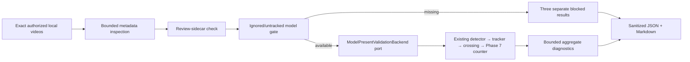

# Phase 10.3 — Real-World Detector, Tracking and Counting Validation

## Objective and evidence boundary

Phase 10.3 adds a controlled, local-only validation workflow over authorized
real video. It separates metadata facts, manual truth, derived metrics, unknown
values, and non-applicable values. It does not make a detector, tracking,
counting-accuracy, production-readiness, or operational-approval claim.

The August 1, 2026 local evidence run was hard-gated before inference because
no compatible model existed in `data/models/`, `models/`, or `weights/`.
Therefore:

> REAL DETECTOR VALIDATION COULD NOT BE COMPLETED

No detector, tracker, crossing detector, or counter was run against the local
media. The phase delivers validation infrastructure and truthful blocked
evidence, not successful real-model validation.

## Authorized inputs

Only these three ignored local basenames are authorized:

| Sanitized ID | Exact local basename | Authorized role |
| --- | --- | --- |
| `video_1` | `WhatsApp Video 2026-07-18 at 9.39.07 AM.mp4` | Primary calibration/counting reference; detection, tracking, and counting candidate. |
| `video_2` | `WhatsApp Video 2026-07-18 at 9.42.24 AM.mp4` | Separate difficult counting candidate with wider movement, people, denser groups, and likely occlusion. |
| `video_3` | `WhatsApp Video 2026-07-18 at 9.43.17 AM.mp4` | Detection/tracking stress only; multiple directions and manual marking. |

Video 3 is never count-accuracy evidence. Every count-related Video 3 field is
`NOT_APPLICABLE` and every result contains:

> NOT VALID FOR COUNTING ACCURACY

The workflow rejects every other basename. It never discovers arbitrary media,
renames files, extracts frames, writes images, or copies videos.

## Architecture



`hogflow.validation` owns immutable path-free validation models, the strict
catalog, local artifact verification, serial orchestration, and reporting. It
may consume public data, detection, tracking, crossing, counting, and Phase 6
evaluation boundaries. It imports no CV framework, UI, storage, worker,
threading, or async package. Concrete local metadata composition remains in
`hogflow.video.real_world_validation_cli`.

The `ModelPresentValidationBackend` is dependency-injected. CI uses a fake
backend; a real implementation must compose the existing Phase 10.2
`LiveDetector` and Phase 5–7 public boundaries. It may not invent another
detector, tracker, crossing rule, counter, worker, or queue.

## Model availability gate

The gate searches only `data/models/`, `models/`, and `weights/` for `.pt`,
`.onnx`, and `.engine`. A candidate must be a file, ignored, untracked, and
inside an approved root. Zero artifacts is `MISSING`; multiple artifacts are
`AMBIGUOUS` until explicitly selected; tracked or unignored artifacts are
`REJECTED`. Only one approved artifact is `AVAILABLE`.

Artifact hashing is performed once at controlled discovery using bounded
one-megabyte chunks. Reports expose only format, a generic sanitized identity,
and SHA-256 fingerprint. They never expose a local model path or basename.

Missing or non-available model state is a hard gate: backend invocation is
impossible, and runtime metrics remain `UNKNOWN` rather than fabricated zeroes.

## Review sidecars and ground truth

The exact Phase 3 sidecar convention is `<video filename>.review.json`. No
sidecar existed beside any of the three files during this run. Historical
authorization and candidate classifications therefore come from the explicit
Phase 10.3 owner authorization; no sidecar was generated or rewritten.

A manual total may establish only a count reference. It may derive signed
count difference, absolute error, and percentage error when a measured system
count exists. It cannot derive detector precision, recall, F1, frame-level
false positives, or frame-level false negatives. Those stay `UNKNOWN` without
independent frame/event annotations. No manual totals were available in the
local records inspected.

## Validation and calibration models

Each scalar uses one explicit state:

- `MEASURED`;
- `PROVIDED_MANUAL_GROUND_TRUTH`;
- `DERIVED`;
- `UNKNOWN`;
- `NOT_APPLICABLE`.

`VideoValidationResult` stores bounded aggregate performance, detector,
tracking, crossing/counting, ground-truth, provenance, limitations, and one
fingerprint. It contains no path, frame, image, tensor, framework result,
per-frame box history, or unbounded error history. A
`RealWorldValidationReport` contains exactly one result for each sanitized ID
in the required order.

`CalibrationCandidate` fingerprints explicit confidence/IoU thresholds,
inference size, tracker update rate, lost-track buffer, maximum detections,
positive direction, and a Phase 6 `LineCandidate`. `CalibrationPlan` is scoped
to exactly one video, sorts candidates deterministically, and converts to a
Phase 6 `LineEvaluationPlan` with `NO_AUTOMATIC_RECOMMENDATION`. Video 1 and
Video 2 therefore have independently declared geometry and provenance.
Sequence gaps remain observations; no frame or path is interpolated. No plan
changes live defaults or silently declares an optimum.

## Processing and failure policy

The order is fixed: Video 1, then Video 2 only after Video 1 is structurally
complete, then optional Video 3 diagnostics. Model-present results must match
the requested video, candidate, and sanitized model gate exactly. Mismatched
provenance or backend failures stop safely.

Expected categories include missing/unreadable video, ignore violation,
unsupported/missing/ambiguous/rejected model, invalid calibration,
model/backend failure, incomplete structural run, missing manual truth, and
output failure. A blocked or failed stage never fabricates downstream
detections, tracks, crossing events, or counts.

## Reporting and local output

The headless CLI is:

```powershell
python -m hogflow.video.real_world_validation_cli
```

It writes deterministic-schema JSON and bounded Markdown only under ignored
local roots (`data/evaluation/`, `data/runs/`, or `data/metrics/`). Standard
output contains only sanitized IDs, states, fingerprints, and verdict. Reports
contain no absolute paths, source filenames, model basenames, usernames,
credentials, frames, screenshots, raw detections, stack traces, or framework
objects.

If an artifact passes the model gate, calibrated model-present execution must
be supplied explicitly through the public backend boundary. There is no remote
download, generic-pretrained substitution, automatic candidate selection, or
production-config mutation.

## Remaining limitations

- No compatible local pig detector was available.
- No real inference, tracking, crossing, or counting run occurred.
- No manual count ground truth or frame/event annotations were found.
- ID switches, fragmentation, lifetime, occlusion, and line sensitivity remain
  unknown on the authorized videos.
- Video 1 and Video 2 line geometry and positive direction remain uncalibrated.
- Video 3 is diagnostic only.
- No physical/GPU performance, first-inference, steady-state FPS, memory, or
  long-run evidence was created.
- Supervision ByteTrack 0.29.1 remains deprecated.
- Phase 10.4 and Phase 11 were not started.
