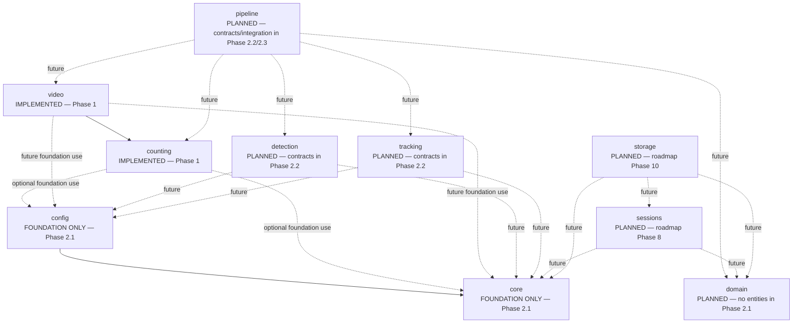

# Phase 2.1 — Architecture Foundation

## Objective

Phase 2.1 establishes stable package boundaries, shared technical foundations, explicit dependency rules, and automated architecture checks. It adds no product feature and does not change the Phase 1 counting or video behavior.

## Existing approved functionality

The approved Phase 1 finite-segment directional counter and generic people/vehicle video proof of concept remain in their original modules. Their public imports, command-line behavior, counting rules, event semantics, model choice, and tracker behavior are unchanged.

## Module map

The planned-package nodes represent responsibility boundaries only. Detector and tracker contracts do not exist in Phase 2.1, and no pipeline orchestration is implemented.

## Current responsibilities

* `core`: shared expected-error hierarchy and application-entrypoint logging configuration.
* `config`: minimal immutable logging and runtime settings.
* `counting`: approved Phase 1 detector-independent finite-segment counting logic.
* `video`: approved Phase 1 generic video, detector/tracker, JSONL, and annotation integration.
* `detection`: planned location for Phase 2.2 detector contracts and later implementations.
* `tracking`: planned location for Phase 2.2 tracker contracts and later adapters.
* `pipeline`: planned orchestration boundary; no orchestration exists in Phase 2.1.
* `domain`: planned operational metadata boundary; no operational entity exists in Phase 2.1.
* `sessions`: planned session lifecycle boundary for roadmap Phase 8.
* `storage`: planned persistence boundary for roadmap Phase 10.

## Import-side-effect policy

Importing a HogFlow package or module must not:

* download models
* open video files
* create or initialize cameras
* access networks
* create databases
* configure root logging
* execute processing loops

Required setup and runtime work must happen through an explicit application call.

## Error policy

Expected configuration, dependency-availability, and user-input failures may use the shared HogFlow exception hierarchy when the relevant module is integrated with it.

Programmer errors must not be swallowed or converted indiscriminately into expected application errors. A broad `except Exception` should exist only when it adds useful context or guarantees cleanup, and it must preserve causality with `raise ... from exc` when wrapping an error.

Phase 1 exceptions are not refactored in Phase 2.1; that integration is deferred to Phase 2.3 unless a separately approved requirement changes the plan.

## Logging policy

Library modules retrieve named loggers with `get_logger()` and do not configure global logging. Application entrypoints explicitly call `configure_logging()` when logging setup is required. Package imports never configure root logging.

Logs must not contain credentials, confidential information, private media paths, or unauthorized operational data.

## Configuration policy

Foundational settings are explicit, validated, and immutable after construction. Phase 2.1 does not provide YAML, TOML, JSON, dotenv, environment-variable, or Pydantic loading.

Feature-specific settings are introduced only when the corresponding feature has a current requirement. There are no detector, tracker, video, line, session, database, model-path, or camera settings in this subphase.

## Future operational-domain compatibility

Future authorized operational workflows may need to represent generic concerns such as:

* one truck receiving event
* a variable number of weighings
* multiple supplier or company groups
* configurable pig-category labels, which might include facility-defined labels such as Regular, OPG, P12, or NAE
* partial truck loads
* small loads
* separately recorded animal exception events
* possible movement through a side passage

These are PLANNED architectural context only. No receiving entity, group entity, weighing entity, category model, exception-event model, or side-passage behavior is implemented in Phase 2.1. The examples are not claimed to be universal across facilities, and no automatic health-condition or animal-welfare classification is proposed or implemented.

The package boundaries are intended to keep future authorized operational metadata separate from computer-vision counting. Operational metadata must not alter the approved Phase 1 counter implicitly.

## Phase boundary

Phase 2.1 does not implement:

* detector, tracker, video-source, annotation, or pipeline contracts from Phase 2.2
* Phase 2.3 adapters or pipeline orchestration
* new detection, tracking, counting, or video behavior
* pig-specific detection or validation
* operational receiving entities or workflows
* automatic animal-condition detection or classification
* sessions, event management, storage, SQLite, UI, or application services
* model downloads, model loading, cameras, or media processing
* dependency injection, service containers, event buses, repositories, or speculative enterprise layers
