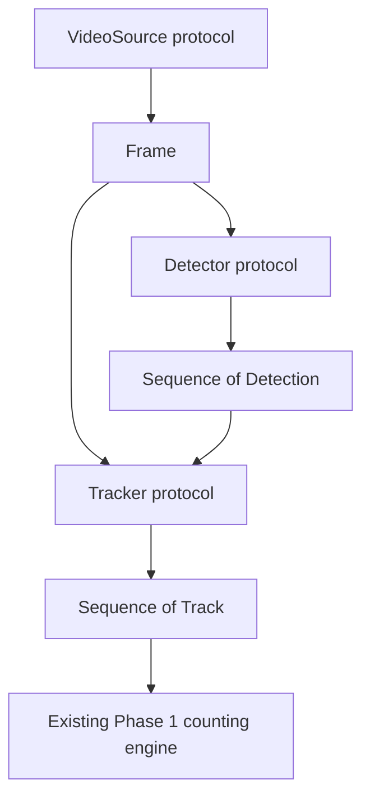

# Phase 2.2 — Interfaces & Contracts

## Objective

Phase 2.2 establishes the framework-independent communication layer for future video sources, detectors, and trackers. It defines data and behavior contracts only. It does not execute a pipeline, adapt a computer-vision framework, or change the approved Phase 1 counting behavior.

## Contract data flow

This diagram describes the compatible data boundaries defined in Phase 2.2.
That subphase did not define execution order, scheduling, threading, buffering,
multiprocessing, conversion to counting points, or orchestration. Phase 2.3
later implemented the approved synchronous integration.

## Dependency direction

The Phase 2.2 dependency direction is:

`future implementations → contracts → shared models → core`

The shared models live in `hogflow.models` because detection, tracking, and video contracts all need the same lower-level data language. Placing those models in any one contract package would make the other contracts depend sideways or upward.

Contracts never depend on implementations. The contract layer does not import OpenCV, NumPy, Torch, Ultralytics, Supervision, ByteTrack, BoT-SORT, TensorRT, ONNX Runtime, or another computer-vision framework.

## Shared immutable models

All four models are frozen, slotted dataclasses. They contain data invariants but no counting, tracking, inference, orchestration, persistence, or session business logic.

### `Frame`

`Frame` is the canonical framework-neutral image input. It contains:

* non-negative `frame_index`
* positive `width` and `height`
* immutable `pixels` as row-major packed eight-bit RGB bytes
* optional finite, non-negative `timestamp_seconds`

The byte payload must contain exactly `width * height * 3` bytes. Future video adapters own conversion from their private framework representation into this canonical format.

### `BoundingBox`

`BoundingBox` contains finite `x_min`, `y_min`, `x_max`, and `y_max` coordinates. It is axis-aligned and must have positive width and height. Coordinates use the associated frame's coordinate system.

### `Detection`

`Detection` contains:

* one `BoundingBox`
* confidence in the inclusive range from 0 to 1
* a non-negative detector class ID
* a non-empty detector class name

It contains no tracker identity and no counting state.

### `Track`

`Track` composes one `Detection` with a non-negative `tracker_id`. The ID is stable only according to the lifetime and behavior of a future tracker implementation. It is not a biological identity, database ID, count order, business identifier, or session identifier.

## Detector protocol

`Detector.predict(frame)` receives exactly one immutable `Frame` and returns `Sequence[Detection]`.

The protocol guarantees a framework-neutral input and output boundary. Returned detections are immutable and caller-owned. The returned sequence is treated as immutable and must not be changed by the implementation after return.

The protocol deliberately does not:

* construct or configure a model
* expose model paths, devices, thresholds, batch settings, or NMS settings
* assign tracker IDs
* count, draw, log application state, manage sessions, open sources, or write files
* promise real-time performance, a particular device, deterministic latency, or thread safety

Implementations may maintain private state and resources. They are expected to be reusable, but construction and cleanup remain implementation concerns. Expected input, dependency, and inference failures should use documented HogFlow exceptions where appropriate. Programming errors must remain visible.

The Protocol introduces no stochastic behavior. Repeatability for an identical implementation, model, configuration, and frame remains an implementation responsibility.

## Tracker protocol

`Tracker.update(frame, detections)` receives one immutable `Frame` and the immutable detections for that frame, then returns `Sequence[Track]`.

The protocol guarantees only the identity-association boundary. Returned tracks are immutable and caller-owned. The returned sequence is treated as immutable and must not be changed by the implementation after return.

The protocol deliberately does not:

* generate detections
* expose association thresholds, motion models, assignment algorithms, re-identification models, maximum age, or minimum hits
* define persistent or biological identity
* know counting lines, crossing history, duplicate prevention, sessions, or business rules
* schedule work, render output, write files, or promise thread safety

A tracker implementation may retain private state across frames. Its construction, cleanup, configuration, and concurrency guarantees remain implementation concerns. Expected input, dependency, and tracking failures should use documented HogFlow exceptions where appropriate. Programming errors must remain visible.

The Protocol introduces no stochastic behavior. Repeatability for identical initialization, configuration, frame sequence, and detections remains an implementation responsibility.

## VideoSource protocol

`VideoSource.read()` returns the next immutable `Frame`, or `None` at normal end of input. `VideoSource.close()` releases resources owned by the implementation.

The implementation owns its input resource and decoding state. The caller owns the source lifetime and must close it. Returned frames are caller-owned and may be retained.

The protocol deliberately does not select a decoder, open a camera by itself, buffer, seek, schedule work, detect, track, count, or guarantee latency or thread safety. File, camera, and OpenCV implementations are not part of Phase 2.2.

The Protocol introduces no stochastic behavior. Sequence repeatability for an identical source and configuration remains an implementation responsibility.

## Failure and mutability policy

Contract methods perform no work because Protocol methods contain no implementation. Future implementations should use documented HogFlow exceptions for expected input, dependency, inference, tracking, decoding, and resource failures where appropriate. Broad exception suppression is prohibited, and programming errors must not be hidden.

Shared model instances are immutable. Implementations may use private mutable state, but that state cannot cross a contract boundary. No contract import configures logging, starts processing, accesses a device, opens media, or downloads a model.

## Phase 1 compatibility

Phase 2.2 does not modify:

* `hogflow.counting.line_crossing`
* `hogflow.video.generic_counter`
* finite-segment crossing behavior
* epsilon behavior
* unique positive counting
* reverse-event behavior
* duplicate prevention
* the existing CLI
* the existing JSONL event format

At Phase 2.2 completion, the Phase 1 video integration did not yet implement
these contracts. Its later adaptation is documented in the Phase 2.3 design
and summary.

## Phase boundary

Phase 2.2 includes only immutable communication models, three small Protocol definitions, documentation, and contract/architecture tests.

It does not include concrete detectors, concrete trackers, video adapters, pipeline execution, model loading, camera access, pig-specific behavior, sessions, storage, databases, configuration loaders, user interfaces, operational-domain entities, analytics, serialization, dependency-injection infrastructure, plugin systems, or message infrastructure.
