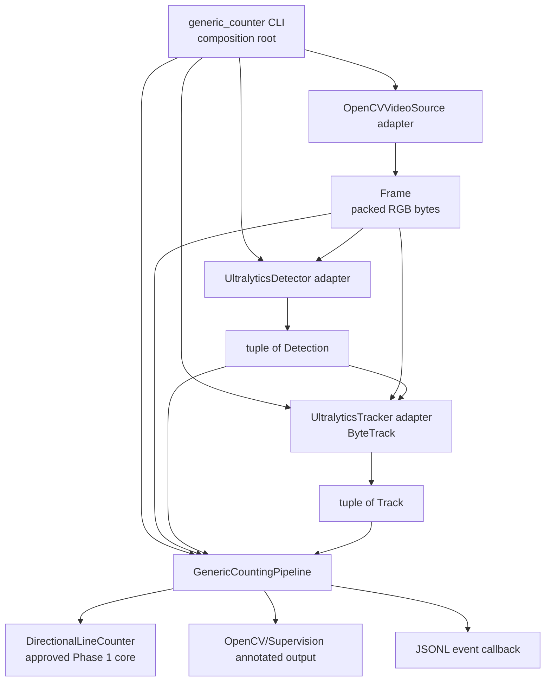

# Phase 2.3 — Generic Pipeline Integration Design

## Objective

Phase 2.3 adapts the approved Phase 1 generic people/vehicle counter to the
framework-independent Phase 2.2 contracts. It adds concrete infrastructure
adapters and one synchronous orchestrator without changing finite-segment
counting semantics, CLI arguments, event fields, or the project hypothesis.

## Architecture and data flow

The diagram describes synchronous data flow. It does not add scheduling,
threading, queues, multiprocessing, streaming infrastructure, sessions, or
persistence.

## Adapter boundaries

### OpenCV video source

`OpenCVVideoSource` owns `cv2.VideoCapture`. It validates a local file, reads
BGR arrays, converts each frame to RGB, packs the RGB data into immutable
bytes, and returns a `Frame`. Frame indexes begin at zero. Timestamps are
derived deterministically as `frame_index / fps` because container timestamps
are not uniformly reliable. Normal end of input returns `None`, and repeated
`close()` calls are safe.

### Ultralytics detector

`UltralyticsDetector` owns the configured generic YOLO model. It reconstructs
an RGB array from `Frame.pixels`, converts that array to BGR input, performs one
inference, applies the requested class and confidence boundary, and returns a
tuple of immutable `Detection` values. Ultralytics result objects never leave
the adapter.

### Ultralytics tracker

The installed Ultralytics 8.4 tracker API accepts a results-like collection of
external bounding boxes, confidence values, and classes. The
`UltralyticsTracker` adapter therefore supplies the detections already produced
by `Detector.predict()` directly to ByteTrack. It does not invoke detection,
discard detector output, or run inference twice. ByteTrack arrays and state
remain private, and callers receive only immutable `Track` values.

There is no transitional combined detector/tracker compromise in this
implementation. Tracker IDs retain the limitations of ByteTrack and are not
biological or persistent identities.

## Pipeline responsibilities

`GenericCountingPipeline`:

* reads one `Frame` at a time from `VideoSource`
* calls `Detector.predict(frame)` exactly once
* calls `Tracker.update(frame, detections)` exactly once
* converts each track bounding box to its bottom-center `Point`
* delegates line crossing, direction, duplicate prevention, and count state to
  `DirectionalLineCounter`
* forwards actual crossing events with the count at event time
* emits one immutable `PipelineFrameResult` per processed frame
* returns a small `PipelineRunSummary`
* closes the source on normal completion and failure
* forgets transient counter-side tracker state after the configured TTL

The pipeline does not evaluate segment geometry, increment counts directly,
annotate pixels, write JSON, perform model conversion, or implement sessions.
`DirectionalLineCounter` remains the single source of count truth. Its counted
tracker-ID set is never cleared by inactivity cleanup.

## Composition and output

`hogflow.video.generic_counter` remains the CLI entrypoint and is now the
composition root. It parses the existing arguments, constructs adapters,
constructs the approved counter and pipeline, opens the JSONL event file, and
connects the infrastructure-facing annotated-video output callback.

The output collaborator privately reconstructs an OpenCV frame and preserves
the Phase 1 information display: bounding boxes, tracker IDs, configured finite
segment, current count, and selected class. The JSONL callback preserves the
approved field names and writes only actual counter events.

## Dependency direction

The implemented direction is:

* `adapters → contracts/models/core`
* `pipeline → contracts/models/counting`
* `video CLI/output → adapters/pipeline/counting/core`
* `contracts/models/counting → no CV frameworks`

The pipeline does not import adapters. The CLI chooses concrete adapters.

## Performance tradeoff

The approved `Frame` model stores packed RGB bytes. OpenCV decoding therefore
requires BGR-to-RGB conversion and the detector boundary reconstructs an array
and converts RGB back to BGR. This creates explicit conversion overhead. Phase
2.3 preserves the approved contract rather than leaking mutable NumPy arrays.
The pipeline retains only current-frame data and does not perform duplicate
inference.

## Failure handling

Expected missing-dependency, invalid-input, invalid-configuration, model-load,
inference, tracking, and output failures use the existing HogFlow exception
hierarchy with causal exceptions preserved. Pipeline cleanup uses `finally` so
the source closes after success or failure. Programming errors are not broadly
suppressed.

## Non-responsibilities

Phase 2.3 adds no pig-specific data, model, tracker validation, session state,
SQLite storage, user interface, operational workflow, analytics, or
ground-truth evaluation. Phase 3 has not started.
