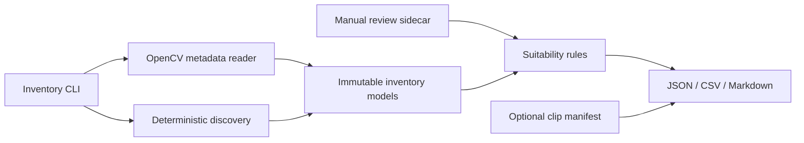

# Phase 3 — Video Inventory Design

## Architecture

Phase 3 separates framework-neutral inventory data and policy from OpenCV inspection:



Implemented dependency direction:

- `hogflow.data.models` contains frozen, slotted, framework-neutral records.
- `hogflow.data.validation` contains discovery, sidecar/manifest parsing, and conservative
  suitability rules without importing OpenCV or NumPy.
- `hogflow.video.metadata` is the infrastructure boundary that loads OpenCV and NumPy lazily.
- `hogflow.data.inventory` is the CLI composition root and report writer.

Importing framework-independent data modules does not require OpenCV. Framework arrays never
appear in public metadata models or report values.

## Immutable models

`VideoFileMetadata` records relative path, file size, container extension, estimated duration,
FPS, frame count, dimensions, codec, readability, validation errors, bounded-sample count,
automatic stability evidence, inventory suitability labels, and optional review metadata.

`DatasetInventorySummary` records total/readable/unreadable files, total duration and size,
resolution distribution, FPS range, stability-label counts, and suitability-label counts.

`ManualReviewMetadata` and `ClipManifestEntry` preserve explicit human facts without creating
sessions, storage records, or business entities.

## Discovery

Discovery is recursive and deterministic. Paths are returned relative to the configured root
and sorted case-insensitively. The supported extensions are explicit: `.avi`, `.m4v`, `.mkv`,
`.mov`, `.mp4`, and `.webm`. Hidden paths, generated-data directories, partial files,
thumbnails, and unsupported extensions are excluded. An empty root produces an empty
inventory.

## Bounded metadata inspection

OpenCV reads container properties and decodes a configurable bounded set of deterministic
sample positions. The reader does not decode an entire video by default. It reports:

- inability to open a file;
- invalid dimensions, FPS, or frame count;
- zero or unavailable duration;
- failure at a bounded sample position;
- changing decoded dimensions; and
- unsupported extension when called directly.

Duration is estimated as `frame_count / fps` when both properties are valid. Codec is decoded
from FourCC when available. Sampling seeks across the reported frame range; when the frame
count is unavailable, it performs only a bounded sequential read.

## Conservative camera-motion estimate

Each sampled frame is converted to grayscale and optionally downscaled. The reader detects
image features, tracks them with pyramidal optical flow, and uses RANSAC to estimate a global
partial affine transform. Translation and rotational displacement are normalized by frame
diagonal and summarized with a median percentage score.

Configurable thresholds map sufficient evidence to:

- `likely_static`;
- `low_motion`;
- `moving_camera`; or
- `unknown` when there are too few frames, features, or reliable transforms.

This is not a scientific stabilization measurement and does not prove a fixed camera. Dense
animal movement or another dominant foreground object can supply most detected features and
cause false motion or false stability labels. Human review takes precedence for scene
qualification.

## Manual review sidecar

For `clip.mp4`, place `clip.mp4.review.json` beside the video. The required fields are:

```json
{
  "authorized_for_project": true,
  "source_type": "licensed",
  "source_reference": "Non-secret license or source record",
  "license_or_permission_notes": "Why this use is permitted",
  "camera_static_confirmed": true,
  "clear_passage_confirmed": true,
  "predominant_direction_confirmed": true,
  "counting_line_possible": true,
  "intended_use": ["detection", "tracking", "counting"],
  "reviewer_notes": "Non-private review notes"
}
```

Allowed source types are `licensed`, `other_authorized`, `public_domain`,
`research_dataset`, `self_recorded`, and `synthetic`. Scene-confirmation fields may be `null`
until reviewed. Invalid or missing sidecars never grant authorization.

## Suitability rules

Candidate labels require an affirmative authorization sidecar. Detection and tracking labels
also require valid technical metadata and configurable minimum durations. Automatic
`moving_camera` evidence blocks normal tracking candidacy unless a human has explicitly
confirmed a static camera.

Counting candidacy is never inferred solely from metadata or motion estimation. It requires
all four human scene confirmations. Difficult authorized readable clips can be labeled for
stress testing. Incomplete evidence remains `needs_manual_review`.

## Outputs and safety

The CLI writes `inventory.json`, `inventory.csv`, and `inventory.md` using temporary files and
same-directory replacement. Outputs contain metadata and review records but no frames or
thumbnails. Paths inside inventory records are relative; generated reports live under the
Git-ignored processed-data directory by default.

The source video is opened read-only and never rewritten. Inventory reports remain local and
must be reviewed before sharing because user-entered source references or notes may still be
sensitive even though credentials and personal information are prohibited.
