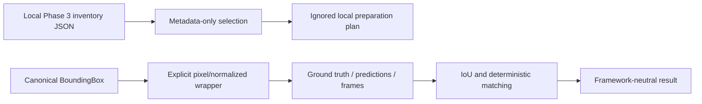

# Phase 4.1 — CI and Detection Evaluation Foundation

## Status

Phase 4.1 infrastructure implemented. Real pig annotation is not completed, no pig detector
has been trained or validated, no accuracy result exists, and Phase 4.2 has not started.

## Scope

Phase 4.1 provides:

- source-only GitHub Actions continuous integration;
- immutable framework-neutral detection-evaluation models;
- deterministic bounding-box geometry, matching, and basic metrics;
- metadata-only selection from a local Phase 3 inventory;
- an ignored local annotation/model/run/evaluation workspace; and
- synthetic tests and architecture protections.

It does not perform detector inference, training, fine-tuning, frame extraction, annotation,
tracking evaluation, counting evaluation, or mAP calculation.

## Continuous integration

`.github/workflows/ci.yml` runs for pushes to `main` and pull requests targeting `main` on
Ubuntu with Python 3.12. It receives only `contents: read` permission and executes:

```bash
python -m ruff check --no-cache .
python -m ruff format --check --no-cache .
python -m pytest
python -m compileall -q src
python -m pip check
```

The workflow installs the project with `python -m pip install -e ".[dev]"` and caches pip
downloads using `pyproject.toml` as the dependency key. It does not access `data/raw`, upload
artifacts, download media or weights, or use real fixtures. CI validates source quality and
synthetic behavior only; it cannot validate real pig-video quality or model accuracy.

## Architecture



Implemented dependency direction:

- `hogflow.evaluation.detection_models` depends only on `core` and canonical `models`.
- `hogflow.evaluation.detection_metrics` depends only on evaluation models and `core`.
- `hogflow.evaluation.dataset_selection` depends only on `core` and the standard library.
- no evaluation-domain module imports OpenCV, NumPy, Ultralytics, Supervision, or Torch.

The existing detector contract and generic pipeline are unchanged. Phase 4.1 does not add a
pig detector implementation.

## Dataset selection

The local CLI reads inventory JSON only. It never opens, decodes, copies, or uploads a video.
A selected item must be readable, explicitly authorized, labeled `detection_candidate`, and
free from fatal technical validation errors. Unreadable, unauthorized, or technically fatal
items are rejected. Technically valid authorized items without detection candidacy are either
rejected or marked for manual review according to Phase 3 labels.

Counting suitability is ignored as detector-performance evidence. A counting candidate is not
automatically a detection candidate. Conversely, a detection candidate may be selected while
still requiring manual review for counting-specific reasons.

Preparation-plan decisions contain deterministic opaque clip IDs, statuses, and reasons. They
do not contain inventory paths, private filenames, source references, authorization notes, or
reviewer notes.

## Local data policy

All videos, sidecars, annotations, manifests, frames, exports, weights, inference runs, and
evaluation reports remain local. `.gitignore` protects:

- `data/annotations/{raw,interim,processed}`;
- `data/models`;
- `data/runs`;
- `data/evaluation`;
- YOLO and COCO dataset directories;
- root Ultralytics-style `runs` and `weights` directories;
- review sidecars, arrays, checkpoints, weights, and common model formats; and
- existing Phase 3 raw/interim/processed workspaces.

Only approved examples and `.gitkeep` placeholders are tracked.

## Failure handling

Malformed inventories, path-like inventory references, invalid JSON, inconsistent types, and
unwritable outputs raise documented HogFlow input errors. The CLI translates expected errors
into concise argument-parser failures. Programming defects remain visible.

## Evidence boundary

Passing CI and synthetic tests demonstrates that the source-level contracts and calculations
behave as specified. It does not demonstrate pig detection, generalization, mAP, counting
accuracy, operational value, or production readiness.
