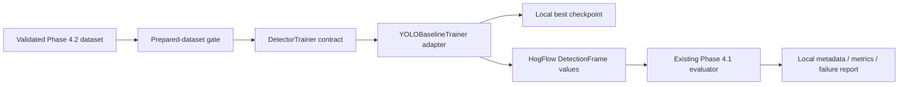

# Phase 4.3 — Local Baseline Pig Detector Training

## Status and evidence boundary

Phase 4.3 implements one replaceable local baseline-training pipeline. The
training pipeline is operational, but no real pig detector was trained during
implementation because no finalized local annotation manifest was present.
Synthetic tests exercise the architecture and control flow; they do not
produce detector-quality evidence.

No model weight, dataset, annotation, run, framework cache, metric report, or
failure report is committed. Phase 5 has not started.

## Architecture



The `hogflow.training` package contains immutable configuration, results,
dataset validation, orchestration, reporting, and the small `DetectorTrainer`
contract. It imports no Ultralytics, Torch, OpenCV, NumPy, or Supervision.
`YOLOBaselineTrainer` is the sole Phase 4.3 Ultralytics boundary.

Replacing YOLO requires another adapter implementing `DetectorTrainer`. The
prepared-dataset gate, HogFlow metrics, failure summary, and report format do
not need to change.

## Pre-training gate

Training begins only after the Phase 4.2 manifest and dataset pass the existing
annotation validator. The gate checks:

- source-video split isolation;
- readable images and matching checksums/dimensions;
- class map `0 = pig`;
- deterministic valid YOLO labels;
- explicit annotation/verified-empty state;
- no unready frames in active train, validation, or test directories; and
- non-empty train and validation splits.

Preparation-only datasets cannot be trained. This prevents a small collection
from being silently treated as a defensible experiment.

## Configuration and reproducibility

`TrainingConfiguration` is a frozen dataclass. It records epochs, batch size,
image size, device, optimizer, workers, seed, deterministic mode, confidence
and IoU thresholds, small-object threshold, evaluation split, and opaque run
name.

Defaults favor repeatability: CPU, seed 42, zero data-loader workers, and 25
epochs. Phase 4.3 enforces a maximum of 30 epochs. CUDA can be selected
explicitly, but some CUDA kernels and hardware-dependent operations may remain
nondeterministic even when deterministic mode and a seed are configured.

Local metadata records the configuration, sanitized dataset fingerprint,
package version, Git commit, trainer/version, model filename, and an
output-relative best-checkpoint location. It never records source-video paths
or private filenames.

## Local training command

After a finalized source-level train/validation dataset exists:

```bash
python -m hogflow.adapters.yolo_training \
  --dataset data/annotations/raw \
  --manifest data/annotations/raw/metadata/dataset_manifest.json \
  --output-root data \
  --model yolo11n.pt \
  --epochs 25 \
  --batch-size 8 \
  --image-size 640 \
  --device cpu \
  --optimizer AdamW \
  --workers 0 \
  --seed 42 \
  --evaluation-split validation \
  --run-name phase4-3-baseline
```

Model loading occurs only after dataset validation. If the named official
pretrained checkpoint is not already cached, Ultralytics may download it when
this explicit local command is run. Tests and CI never load or download it.

## Validation and metrics

After training, the adapter validates the exported best checkpoint and converts
predictions to immutable `DetectionFrame` values. HogFlow then reuses the
Phase 4.1 deterministic one-to-one evaluator for:

- precision;
- recall;
- F1;
- matched IoU values and mean matched IoU; and
- true-positive, false-positive, and false-negative counts.

Ultralytics metrics, including framework mAP when supplied, are exported under
separate `framework_*` keys. They are never labeled as HogFlow metrics and do
not establish counting accuracy.

## Resume

Resume only from a local checkpoint that retains optimizer/epoch state:

```bash
python -m hogflow.adapters.yolo_training \
  --dataset data/annotations/raw \
  --output-root data \
  --resume data/runs/training/phase4-3-baseline/weights/last.pt \
  --run-name phase4-3-baseline
```

Ultralytics controls checkpoint-format compatibility and resume semantics.
Changing framework versions may make a checkpoint non-resumable. A fresh run
should use a new run name so a different checkpoint is not silently
overwritten.

## Local outputs

The default output root keeps all generated material under ignored directories:

```text
data/
├── models/<run>/best.pt
├── runs/training/<run>/
├── runs/validation/<run>-validation/
├── tensorboard/
├── metrics/<run>/
└── evaluation/<run>/annotation_validation.{json,csv,md}
```

The metrics directory contains training metadata, separately namespaced
framework/HogFlow metrics, a local YOLO dataset configuration, and a Markdown
failure summary. TensorBoard is reserved and ignored; Phase 4.3 does not add a
TensorBoard dependency.

## Failure analysis

The local report summarizes false positives, false negatives, very small
ground-truth pigs, verified-empty frames, and predictions on empty frames.
Heavy-occlusion totals remain explicitly unavailable because Phase 4.2 labels
do not encode occlusion severity. The report does not infer missing labels or
claim detector, tracking, or counting quality.

## Validation commands

```bash
python -m pytest
python -m ruff check --no-cache .
python -m ruff format --check --no-cache .
python -m compileall -q src
python -m pip check
python -m hogflow.adapters.yolo_training --help
git diff --check
```

CI and synthetic tests use fake trainer/model objects and temporary synthetic
images only. They perform no real optimization and upload no artifacts.
