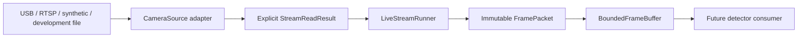

# Phase 5.1 — Live Camera Stream Foundation

## Status and evidence boundary

Phase 5.1 implements a stream-first local acquisition foundation for future
HogFlow processing. The production input goal is a continuously operating live
camera, while prerecorded files remain development and validation tools only.

This phase does not establish general camera compatibility or production
readiness. Implementation validation used deterministic synthetic sources and
fake OpenCV captures; a later Phase 5.1 validation used one laptop USB webcam
through MSMF. No RTSP endpoint, pig detector, tracker, counter, session,
database, dashboard, or cloud service was used.

## Architecture



The framework-neutral `hogflow.streaming` package owns models, configuration,
contracts, sanitization, buffering, health, lifecycle orchestration, and the
synthetic source. OpenCV appears only in `hogflow.adapters`.

The runner is deliberately synchronous at its core. `run()` can execute in the
calling thread, while `start()` provides one small producer thread for a
concurrent consumer. This does not introduce async frameworks, queues beyond
the bounded in-memory buffer, multiprocessing, message brokers, or remote
services.

## Frame ownership and ordering

`FramePacket` contains:

- a sanitized opaque `StreamIdentity`;
- a lifecycle-scoped monotonically increasing sequence number;
- a timezone-aware acquisition timestamp;
- a monotonic timestamp used for ordering and duration;
- an optional source timestamp;
- frame dimensions and RGB24 pixel format;
- immutable packed RGB bytes; and
- a dropped-since-previous-delivery count derived from sequence gaps.

OpenCV BGR arrays are copied to immutable RGB bytes before crossing the adapter
boundary. Consumers own the returned bytes and may retain them. Wall-clock
timestamps are informational; ordering uses the monotonic timestamp.

A future detector can reconstruct its private input representation from
`FramePacket.payload` and `FramePacket.dimensions`. Phase 5.1 performs no such
conversion and executes no detector.

## Camera source contract and outcomes

`CameraSource` defines `open`, `read`, `close`, `is_open`, `health`, and
`statistics`, plus sanitized identity and live/non-live classification.

One read returns an explicit status:

- `frame`: one immutable `SourceFrame` is available;
- `temporary_unavailable`: retry without treating the condition as EOF;
- `end_of_stream`: normal terminal behavior for a development file;
- `interrupted`: a live source disconnected and may reconnect; or
- `stopped`: the source was closed or shutdown was requested.

Fatal open/read conditions use sanitized HogFlow stream exceptions. `None` is
not overloaded to mean EOF, temporary interruption, and fatal failure.

## Supported source types

- `rtsp`: production-priority network camera source supplied at runtime;
- `usb`: production-priority local camera device index;
- `file`: non-live local development/regression source with one-pass EOF; and
- `synthetic`: deterministic source for tests, CI, and bounded diagnostics.

The OpenCV adapter supports best-effort requested width, height, FPS, backend,
read/open timeout where the selected backend accepts it, and warm-up frames.
Cameras are not guaranteed to honor requested settings. Health reports expose
observed dimensions and FPS separately.

## Bounded latency and frame drops

The default buffer capacity is four frames and the default overflow policy is
`drop_oldest`. When acquisition is faster than a future consumer, the oldest
queued frame is removed so recent frames remain available. This prioritizes
bounded latency over processing every frame and prevents delayed video from
growing without limit.

`drop_newest` is available when retaining already queued frames is explicitly
preferred. Both policies record submitted, delivered, dropped, current-depth,
maximum-depth, and last-sequence statistics. Sequence gaps and
`dropped_since_previous` make discarded frames observable.

Closing the buffer unblocks waiting consumers. Pending packets may be drained,
or shutdown may explicitly discard them.

## Reconnection and health

Live USB and RTSP sources may use deterministic exponential backoff with:

- enabled/disabled state;
- initial and maximum delay;
- multiplier;
- bounded or unlimited attempts; and
- attempt reset after a configured stable period.

Temporary read failures retry without busy looping. Repeated failures,
interruptions, or fatal live reads may reconnect. Normal file EOF never loops
or reconnects indefinitely.

Health states are `created`, `opening`, `warming_up`, `running`, `degraded`,
`reconnecting`, `stopped`, and `failed`. Reports retain aggregate counts and
one sanitized error category, not an unbounded error history or raw exception
text. Durations and observed FPS use monotonic time.

Observed-FPS aggregation counts every interval between acquired frames,
including zero-duration intervals produced when a platform monotonic clock is
coarser than frame delivery. This prevents quantized timestamps from
systematically under-reporting acquisition rate.

## Credential and camera-data policy

RTSP URLs and file paths live inside a runtime-only `ProtectedSource`. Its
`str` and `repr` expose only a source type and opaque stream ID. Frame packets,
health, statistics, logs, exceptions, and CLI summaries contain no URL, host,
credential, or private path.

Never place camera credentials in Git, documentation, fixtures, configuration
files, logs, reports, shell transcripts, or issue descriptions. The diagnostic
CLI accepts an RTSP locator at runtime only. Command arguments may be visible
to local operating-system process inspection and shell history, so operators
must follow their local secret-handling policy; Phase 5.1 does not provide a
credential manager.

No frame is saved, recorded, uploaded, transmitted, or previewed by default.
Camera captures, snapshots, recordings, debug dumps, live runs, and camera logs
are Git-ignored.

## Headless diagnostic CLI

USB:

```bash
python -m hogflow.adapters.camera_stream_cli \
  --source-type usb \
  --stream-id receiving-camera \
  --device-index 0 \
  --width 1280 \
  --height 720 \
  --fps 15 \
  --buffer-size 4 \
  --duration 10 \
  --no-display
```

RTSP uses a runtime-provided value, never a tracked example:

```bash
python -m hogflow.adapters.camera_stream_cli \
  --source-type rtsp \
  --stream-id receiving-camera \
  --rtsp-url "<runtime-provided-rtsp-url>" \
  --backend ffmpeg \
  --reconnect \
  --duration 10 \
  --no-display
```

Development file:

```bash
python -m hogflow.adapters.camera_stream_cli \
  --source-type file \
  --stream-id local-regression \
  --file "<authorized-local-development-video>" \
  --max-frames 100 \
  --no-display
```

Synthetic:

```bash
python -m hogflow.adapters.camera_stream_cli \
  --source-type synthetic \
  --stream-id synthetic-check \
  --max-frames 20 \
  --buffer-size 2 \
  --no-display
```

Output is sanitized aggregate JSON containing source ID, health, observed
resolution/FPS, acquired/delivered/dropped frames, reconnect count, buffer
depth, and runtime. Ctrl+C requests shutdown and closes resources. Phase 5.1
does not implement a preview window.

Background shutdown first gives the acquisition thread a short cooperative
grace period to finish its active read and release the source on that same
thread. If the read remains blocked, `join()` falls back to closing the source
from the caller so shutdown does not wait indefinitely.

## Validation

```bash
python -m pytest -q
python -m ruff check --no-cache .
python -m ruff format --check --no-cache .
python -m compileall -q src
python -m pip check
python -m hogflow.adapters.camera_stream_cli --help
git diff --check
```

## Limitations

- One laptop USB webcam was validated through OpenCV MSMF; other cameras,
  backends, and RTSP remain unvalidated.
- OpenCV backend timeout and requested-setting support varies by platform.
- Releasing a capture is a best-effort interruption of backend blocking reads.
- Packed RGB bytes require a copy at the OpenCV boundary.
- The in-process buffer is not a distributed stream or durable queue.
- No frame persistence, preview, telemetry, cloud upload, detector, tracker,
  counting, session, storage, or UI behavior exists in Phase 5.1.
