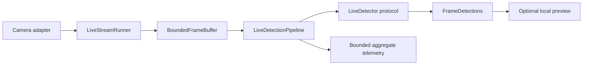

# Phase 5.2 — Live Detection Integration

## Purpose and evidence boundary

Phase 5.2 connects the Phase 5.1 stream-first acquisition boundary to a
replaceable detector. It implements live detector integration only. It does
not implement multi-object tracking, line crossing, counting, sessions,
persistence, recording, or remote telemetry.

No valid local pig-detector artifact with supporting provenance was available
during implementation. Real pig inference is therefore **blocked by missing
validated local pig-detector weights**. The empty, scripted, slow, and failing
detectors validate control flow; they are not pig detectors and provide no
accuracy evidence.

## Architecture



The dependency direction is inward:

* `hogflow.streaming` remains framework-neutral and independent of detection;
* `hogflow.detection` defines immutable live results, detector/preview ports,
  telemetry, errors, and deterministic test doubles;
* `hogflow.pipeline` coordinates streaming and detection contracts without
  importing OpenCV, NumPy, Torch, Ultralytics, tracking, or counting;
* `hogflow.adapters` contains local Ultralytics conversion and OpenCV preview;
* `hogflow.video.live_detection_cli` is the composition root.

The approved Phase 2 `Detector.predict(Frame)` contract remains unchanged for
finite generic video. `LiveDetector` adds the explicit load/infer/close
lifecycle required by an effectively unbounded `FramePacket` stream without
changing the older contract.

## Detector lifecycle and results

`LiveDetector` has four public concerns:

1. `load()` acquires and validates local model resources.
2. `metadata` exposes only sanitized model identity and provenance.
3. `infer(FramePacket)` returns one immutable `FrameDetections` tied to the
   exact source ID, sequence number, and dimensions.
4. `close()` releases resources and is safe to call during cleanup.

`FrameDetections` contains canonical HogFlow `Detection` objects. Framework
arrays, tensors, result containers, and model objects do not cross the adapter
boundary. It records timezone-aware acquisition/inference timestamps, source
identity, dimensions, model identity, optional artifact fingerprint/version,
and measured inference duration.

The contract is serial. It makes no thread-safety guarantee. Phase 5.2 runs one
inference call at a time and does not expose hidden global model state.

## Bounded-latency scheduling

The Phase 5.1 acquisition thread continues independently while inference runs.
There is no second unbounded inference queue. The pipeline drains currently
available source-buffer packets and retains only the newest useful packet.
Superseded packets are counted as inference skips. Frames may also be skipped
because of:

* `inference_every_n_frames`;
* an optional target inference FPS; or
* an optional maximum acceptable frame age.

Pacing never sleeps or blocks camera acquisition. The default is every frame
with no target rate or age limit. The source buffer remains fixed-capacity and
defaults to `drop_oldest`, preserving Phase 5.1's bounded-memory policy.

Camera accounting and inference accounting are intentionally separate:

* source-buffer drops are frames discarded before detector scheduling;
* inference skips are delivered frames intentionally superseded or rejected
  by scheduling;
* inference failures are attempted frames that produced no valid result;
* for the inference stage,
  `submitted = inferred + skipped + failures`;
* acquisition may have frames still pending when a bounded run stops, so no
  unsupported cross-stage equality is asserted.

## Telemetry

`LiveDetectionStats` reports:

* frames acquired, submitted, inferred, skipped, and dropped at source;
* inference failures and total detections;
* average inference latency over successful calls;
* nearest-rank p50 and p95 over a bounded recent latency sample;
* effective inference FPS and observed camera FPS;
* latest and maximum observed frame age, updated after successful inference;
* isolated preview failures.

Only aggregate values are retained. Frames and detections are not accumulated.
Latency percentiles use a configurable fixed-capacity sample window.

## Local Ultralytics adapter

`UltralyticsLiveDetector` requires an explicit existing local artifact path.
It never accepts a model nickname and never downloads weights. Configuration
includes confidence, IoU/NMS threshold, image size, device, and permitted pig
class IDs. The adapter:

* fingerprints the artifact with SHA-256;
* validates the model's class mapping and requires the configured `pig` class;
* reconstructs a NumPy array only inside the adapter;
* converts RGB bytes to detector-ready BGR;
* clips finite boxes to frame bounds;
* rejects malformed, non-finite, out-of-range-confidence, and zero-area boxes;
* returns an empty tuple when no boxes remain; and
* fails explicitly if CUDA is requested but unavailable.

Optional local provenance JSON must match the artifact hash and class mapping
and contain an opaque training run ID, dataset fingerprint, evaluation
reference, and `pig_detection` purpose. Passing this structural check sets
`pig_detection_provenance_complete`; it does **not** prove accuracy, model
quality, or production readiness. Unknown provenance fields remain unknown.

## Failure behavior

Detector load, artifact, class-map, lifecycle, temporary inference, fatal
inference, malformed output, and preview failures have distinct HogFlow error
types. Temporary inference failures increment their own counter and allow the
next packet. Fatal inference failures stop the pipeline and still close the
preview, source runner, and detector. Camera failures remain Phase 5.1 stream
failures and are never relabeled as detector failures.

Preview failures are isolated: preview is disabled for the remainder of the
run while headless detection continues. Programming errors are not suppressed.

## Optional local preview

`OpenCVDetectionPreview` is disabled by default and remains inside the adapter
layer. It displays the current ephemeral frame, pig-class boxes, confidence,
sequence, camera/inference FPS, latency, frame age, and detection count. `q`,
`Q`, Escape, or Ctrl+C request cooperative shutdown.

The preview does not record, save, screenshot, upload, or transmit frames. A
headless run never opens a window.

## CLI

Synthetic integration without a model or camera:

```bash
python -m hogflow.video.live_detection_cli \
  --source-type synthetic \
  --synthetic-frames 100 \
  --detector empty \
  --buffer-capacity 4
```

Local USB inference with an explicitly supplied local artifact:

```bash
python -m hogflow.video.live_detection_cli \
  --source-type usb \
  --device-index 0 \
  --detector yolo \
  --model-path LOCAL_MODEL.pt \
  --model-provenance LOCAL_PROVENANCE.json \
  --confidence 0.40 \
  --iou-threshold 0.50 \
  --inference-every 1 \
  --buffer-capacity 4 \
  --maximum-duration 60
```

The placeholder names above are not paths to tracked artifacts. Real model
files and provenance remain local and ignored. The final line is sorted JSON
containing sanitized source identity, detector/artifact identity, camera and
inference counters, latency, shutdown reason, final camera health, and release
states. No private source locator or full model path is emitted.

The CLI also supports Phase 5.1 USB, RTSP, file-development, and synthetic
sources; every-N pacing; target inference FPS; maximum frame age; frame/time
bounds; permitted class IDs; periodic statistics; and optional preview.

## Privacy

Camera pixels remain local and ephemeral. Phase 5.2 does not record, persist,
upload, transmit, or log frame contents. Camera credentials and protected
locators remain inside Phase 5.1 runtime wrappers. Model weights, provenance,
camera output, preview captures, run output, and local data remain Git-ignored.
No cloud telemetry or network preview exists.

## Validation and limitations

CI uses synthetic sources and framework fakes only. It requires no webcam,
GPU, CUDA, internet, model download, pig video, or private credential.
Synthetic tests validate lifecycle, identity preservation, bounded buffering,
scheduling, failure isolation, telemetry, adapter conversion, preview cleanup,
CLI output, privacy, and architecture boundaries.

One optional local USB-camera smoke test exercised the complete Phase 5.1
camera-to-Phase 5.2 pipeline with `EmptyDetector`, preview disabled, no model,
and no persistence. A 60-second run and immediate 15-second reopen both ended
with stopped health and released camera/detector resources. This is hardware
control-flow evidence only; exact results are recorded in the Phase 5.2
summary.

This does not validate real pig detection, detector accuracy, a physical
camera/model combination, RTSP behavior, tracking, line crossing, or counting.
Phase 5.3 has not started.
