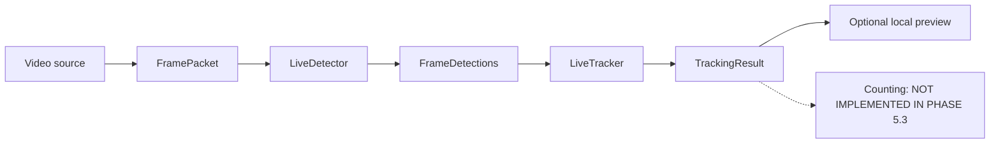

# Phase 5.3 — Live Multi-Object Tracking

## Objective and scope

Phase 5.3 adds temporary object identity to the Phase 5.2 live detection path.
It consumes immutable detection results for one source frame and emits
immutable tracking results for that same source and sequence.

This phase implements no virtual line, crossing rule, pig count, session,
storage, or permanent animal identity. Visible-track telemetry is diagnostic
volume, not a pig count.



## Contracts and models

`LiveTracker` is a framework-neutral lifecycle contract with `start`,
`update`, `reset`, and `close`. It is separate from the protected Phase 2
finite-video `Tracker` contract because live operation needs explicit resource
and stream-lifecycle semantics.

The tracking domain introduces immutable, slotted models:

- `TrackingRequest` binds a tuple of canonical `Detection` objects to one
  opaque source ID, source sequence, timestamp, and frame dimensions.
- `TrackedObject` wraps the canonical `Track`; optional age, hit, and miss
  values remain absent when an adapter cannot expose them truthfully.
- `TrackingResult` retains the exact source/frame identity and sanitized
  tracker provenance.
- `LiveTrackingStats`, `LiveTrackingSnapshot`, and
  `LiveTrackingRunSummary` expose bounded aggregate lifecycle telemetry.

Current-frame results contain only visible objects associated with that
update. Lost or removed framework tracks are not presented as visible. The
only exposed current state is `visible`; Supervision 0.29.1 does not expose a
stable public per-result tentative/lost/removed state through the selected
API.

Track IDs are temporary and meaningful only inside one tracker lifecycle.
They are not biological identities, database identities, session identities,
or count values. Reset may reuse IDs.

## Multi-stream isolation and lifecycle

Phase 5.3 uses one `LiveTracker` instance per stream lifecycle. `start`
explicitly binds the instance to one opaque `stream_id`; requests from another
stream are rejected. A separate pipeline/tracker pair is required for another
camera. This avoids global ByteTrack state and permits independent cleanup.

Requests must have strictly increasing source frame sequences. Gaps are valid:
they may result from camera-buffer drops or Phase 5.2 inference scheduling.
The configured tracker frame-rate remains an engineering timing assumption for
ByteTrack lifecycle behavior; Phase 5.3 does not fabricate intermediate
detections. A stream reconnect causes an explicit tracker reset before the
next update. A new pipeline lifecycle uses a new tracker instance.

`reset` clears temporary identities while retaining the stream binding.
`close` releases private state and is idempotent. The pipeline closes preview,
tracker, detector, and camera through their existing cooperative paths on
normal completion, Ctrl+C, or failure.

## Supervision ByteTrack adapter

`SupervisionByteTrackAdapter` is the real framework adapter. It was verified
against installed `supervision==0.29.1` and uses:

- `supervision.tracker.byte_tracker.core.ByteTrack`
- constructor fields `track_activation_threshold`, `lost_track_buffer`,
  `minimum_matching_threshold`, `frame_rate`, and
  `minimum_consecutive_frames`
- `update_with_detections(Detections)`
- `reset()`

The adapter converts canonical HogFlow detections to private Supervision and
NumPy values, then converts current associations back to canonical `Detection`
and `Track` models. It preserves class, confidence, box, temporary tracker ID,
and a source-detection index when returned by the framework. Framework objects
never cross the adapter boundary.

Supervision marks this bundled `ByteTrack` API deprecated since 0.28 and plans
removal in 0.30. HogFlow currently pins Supervision below 0.30. Replacing this
adapter when the dependency policy changes is explicit technical debt; the
domain contract and pipeline need not change.

Defaults are test-oriented engineering defaults, not pig-validated tuning:

| Setting | Default |
| --- | ---: |
| Track activation threshold | 0.25 |
| Lost-track buffer | 30 frames |
| Minimum matching threshold | 0.8 |
| Assumed tracker frame rate | 30 FPS |
| Minimum consecutive frames | 1 |

## Pipeline and failure behavior

`LiveTrackingPipeline` composes the existing `LiveDetectionPipeline`. Tracking
runs synchronously in the successful detection-result callback. The fixed
Phase 5.1 camera buffer remains the only queue, and Phase 5.2 still drains it
to the newest useful frame. Slow tracking therefore cannot create an
additional unbounded backlog.

Detector failures never cause fabricated empty tracker requests. A temporary
tracking failure is recorded and allows a later frame to continue. Stale
input, malformed output, lifecycle corruption, and fatal adapter errors stop
the run. A preview failure is recorded, closes the preview, and allows
headless tracking to continue.

Tracking telemetry includes request/success/failure counts, zero-detection
updates, tracks emitted, current/peak visible tracks, reset/restart/close
counts, bounded latency aggregates, stale/malformed rejection counts, and a
sanitized latest error category. It retains no frames or unbounded track
history.

## Deterministic diagnostics

Framework-free doubles include `EmptyTracker`, `ScriptedTracker`,
`DeterministicIoUTracker`, `SlowTracker`, and `FailingTracker`. The IoU tracker
exists only for deterministic tests and local integration diagnostics. It is
not a production tracker and does not establish real identity retention,
occlusion performance, or pig-tracking accuracy.

`SyntheticMovingBoxDetector` similarly emits an explicit synthetic moving box
for control-flow tests. It is not model inference.

## Optional preview and CLI

The existing live detection CLI now accepts `--tracker` with `disabled`,
`empty`, `deterministic-iou`, or `bytetrack`. Tracking remains disabled by
default to preserve Phase 5.2 behavior. A requested real tracker never falls
back silently to a fake tracker.

Example synthetic diagnostic:

```bash
python -m hogflow.video.live_detection_cli \
  --source-type synthetic \
  --synthetic-frames 30 \
  --detector synthetic-moving \
  --tracker deterministic-iou
```

Example real ByteTrack boundary diagnostic using synthetic detections:

```bash
python -m hogflow.video.live_detection_cli \
  --source-type synthetic \
  --synthetic-frames 30 \
  --detector synthetic-moving \
  --tracker bytetrack
```

`--preview` remains optional and local. The tracking preview shows current
boxes, temporary IDs, class/confidence, health, and latency. It does not draw a
line or display a crossing/session count. It records and saves nothing.

## Data governance and limitations

Tests use synthetic frames and detections. No camera footage, model weight,
credential, private URL, or employer data is stored or committed. A valid
local pig detector was not available, so Phase 5.3 provides architecture and
control-flow evidence only. It makes no real pig-tracking, ID-switch,
occlusion, throughput, or counting-accuracy claim.
