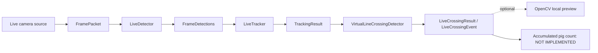

# Phase 5.4 — Live Virtual-Line Crossing Events

## Purpose and boundary

Phase 5.4 connects successful live `TrackingResult` values to deterministic
directional virtual-line crossing events. It stops at `LiveCrossingEvent`.

It does not accumulate an animal total, deduplicate temporary IDs, assign
operational meanings such as “in” or “toward weighing,” manage sessions,
persist events, evaluate line positions, or implement Phase 6 or Phase 7.



## Contracts and ownership

The framework-neutral live crossing modules are:

- `hogflow.counting.live_models`: normalized geometry, configuration, events,
  results, lifecycle state, and aggregate telemetry snapshots;
- `hogflow.counting.live_ports.LiveCrossingDetector`: explicit
  `start/update/reset/close` boundary;
- `hogflow.counting.live_crossing.VirtualLineCrossingDetector`: bounded
  event-only implementation;
- `hogflow.counting.live_telemetry.LiveCrossingTelemetry`: bounded aggregate
  diagnostics;
- `hogflow.pipeline.live_crossing_pipeline.LiveCrossingPipeline`: serial
  composition after successful tracking.

The crossing domain consumes only immutable `TrackingResult` values. It does
not import OpenCV, NumPy, Supervision, Ultralytics, a detector adapter, a
tracker adapter, sessions, storage, or UI code.

## Normalized finite geometry

`NormalizedPoint` accepts finite coordinates from `0.0` through `1.0`.
`NormalizedLine` contains two distinct endpoints. The endpoint order defines
an oriented finite segment from `start` to `end`.

For point `P` and line endpoints `A` and `B`, side classification uses:

```text
cross = (B - A) × (P - A)
```

The cross product is divided by line length before comparison so `epsilon` is
a perpendicular distance in normalized image units:

- distance greater than `epsilon`: `POSITIVE`;
- distance less than negative `epsilon`: `NEGATIVE`;
- absolute distance at most `epsilon`: `ON_LINE`.

Reversing endpoints preserves the same finite segment and reverses positive
and negative sides. A given physical transition therefore receives the
opposite neutral direction.

A stable side transition alone is not sufficient outside the configured
segment. The movement segment between the last and current real stable
observations must intersect the finite virtual-line segment. This preserves the
Phase 1 correction that rejects invisible endpoint extensions.

The intersection check does not create an intermediate frame, timestamp,
trajectory, or crossing point. The current source frame is the observable
event time.

## Representative track point

The default `TrackAnchor.BOTTOM_CENTER` policy uses:

```text
x = (x_min + x_max) / 2 / frame_width
y = y_max / frame_height
```

It is a simple ground-contact proxy for passage-camera geometry. `CENTER` is
also available as a limited technical alternative. Neither policy is validated
for representative pig footage.

## Event semantics

The first stable observation initializes one temporary track and emits no
event. A repeated stable side emits no event. `ON_LINE` emits no event and does
not erase the last stable side or point. Therefore:

- `NEGATIVE → ON_LINE → POSITIVE` emits one
  `NEGATIVE_TO_POSITIVE` event;
- `POSITIVE → ON_LINE → NEGATIVE` emits one
  `POSITIVE_TO_NEGATIVE` event;
- near-line oscillation without reaching the opposite stable side emits none.

`LiveCrossingEvent` records:

- opaque source ID;
- temporary tracker ID;
- crossing lifecycle ID;
- current and previous real frame sequences;
- current frame timestamp;
- neutral geometric direction;
- previous/current stable sides;
- previous/current representative points;
- opaque line ID and deterministic configuration fingerprint.

It intentionally contains no accumulated count, session ID, load ID, storage
identifier, ground truth, or accuracy claim.

## Sequence gaps

Frame sequences must increase strictly, but gaps are valid. Detection
scheduling may skip source frames, and Phase 5.3 does not fabricate tracker
updates for those frames. Crossing follows the same rule.

When two real observations on opposite sides span the finite segment, an event
may be emitted at the current observed frame. A large gap means the exact
physical path and crossing time are unknown. Phase 5.4 performs no trajectory
interpolation and creates no intermediate event.

## Lifecycle, reconnect, and bounded state

One `VirtualLineCrossingDetector` instance binds to one opaque `source_id`.
Cross-stream updates are rejected.

Each start/reset generation has a distinct opaque
`tracker_lifecycle_id`. `reset()` clears all remembered sides, last sequence,
and absence state. `LiveCrossingPipeline` mirrors each tracker reconnect reset
before the next successful crossing update, preventing a reused ByteTrack ID
from inheriting a side from the prior lifecycle.

No cross-lifecycle re-identification or deduplication exists. The same physical
animal could generate events before and after a reconnect; HogFlow cannot yet
resolve that.

State is limited to the latest stable side, point, frame sequence, and
last-seen update for recently visible temporary IDs. An ID is removed after
more than `absent_track_retention_updates` successful tracking results without
being visible. Disappearance creates no event and does not prove an animal
left the physical area.

## Serial live integration

Crossing is disabled by default. Without crossing configuration, the CLI uses
the unchanged Phase 5.3 `LiveTrackingPipeline`.

When enabled, `LiveCrossingPipeline` composes the existing tracking pipeline:

1. one successful tracking result reaches its callback;
2. pending reconnect resets are mirrored;
3. crossing state is updated serially for that exact result;
4. zero or more events are returned;
5. an optional callback/preview receives immutable current results.

There is no crossing queue, frame history, image persistence, or additional
producer thread. The Phase 5.1 bounded source buffer remains the only backlog.
A temporary tracker failure never invokes crossing with fabricated data.

Configuration, lifecycle, stale sequence, malformed input, result-association,
and geometry errors are fatal to that run and trigger normal camera, detector,
tracker, crossing, and preview cleanup. An expected local preview failure is
recorded and isolated; processing continues without preview.

## Diagnostic telemetry

Bounded telemetry includes processed requests, successes, failures, observed
tracks, initialized tracks, on-line observations, events by neutral direction,
active retained identities, lifecycle resets/closes, stale requests, preview
failures, latency, last frame, error category, and health.

`events_emitted`, `active_identities_current`, and temporary ID totals are
diagnostic values. None is a pig count.

## CLI

Crossing requires explicit tracking and both normalized endpoints:

```powershell
python -m hogflow.video.live_detection_cli `
  --source-type synthetic `
  --tracker deterministic-iou `
  --enable-crossing `
  --crossing-line-start 0.10,0.50 `
  --crossing-line-end 0.90,0.50 `
  --crossing-anchor bottom_center `
  --crossing-epsilon 0.005
```

Additional bounded-state configuration:

```text
--crossing-track-retention-updates 30
```

The final JSON reports crossing event diagnostics and resource state. It does
not expose an accumulated animal total. Preview remains off unless `--preview`
is supplied and never records or saves frames.

## Limitations

- No validated pig detector weights or representative pig tracking evidence
  exist in the repository.
- The line is manually configured and not calibrated or evaluated.
- Detection jitter, ID switches, fragmentation, occlusion, dense groups, and
  large frame gaps can create missing or apparent events.
- Temporary IDs may be reused after reconnect; lifecycle qualification prevents
  state leakage but does not identify the same animal across lifecycles.
- Event emission is not count accuracy, tracking accuracy, or production
  readiness.
- Supervision ByteTrack 0.29.1 remains deprecated upstream.
- RTSP production readiness has not been established.
