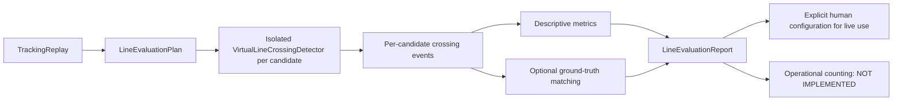

# Phase 6 — Virtual-Line Position Evaluation

## Purpose

Phase 6 provides a deterministic offline workflow for comparing normalized
virtual-line candidates against exactly the same immutable tracking replay.
It reuses Phase 5.4 crossing geometry and emits comparative crossing-event
evidence.

Phase 6 does not select or move the live line automatically. It does not
deduplicate tracker IDs, maintain an accumulated animal count, define an
operational reverse policy, manage sessions, persist events, or implement
Phase 7.



## Architecture

Phase 6 is implemented under `hogflow.evaluation`:

- `line_models`: immutable candidates, plans, replays, ground truth, metrics,
  results, reports, evidence levels, ranking policies, and telemetry;
- `line_matching`: deterministic greedy one-to-one event matching;
- `line_evaluator`: serial candidate evaluation and ranking;
- `line_io`: strict versioned JSON parsing and atomic sanitized output;
- `line_positions`: headless offline CLI;
- `line_errors`: expected configuration, schema, replay, matching, execution,
  and output failures.

The dependency direction is:

```text
evaluation
  → counting.live_* models and detector
  → tracking immutable models
  → canonical models/core
```

`counting` and `tracking` do not depend on `evaluation`. The evaluator imports
no OpenCV, NumPy, Supervision, Ultralytics, camera, detector adapter, pipeline,
session, storage, or UI module.

## Candidates and plans

`LineCandidate` contains:

- opaque `candidate_id`;
- `NormalizedLine`;
- `TrackAnchor`;
- normalized epsilon;
- absence-retention update limit;
- optional short description;
- up to sixteen unique short tags;
- deterministic SHA-256 fingerprint.

`LineEvaluationPlan` requires at least one unique candidate and canonically
sorts candidates by ID. Its fingerprint is therefore independent of input
candidate order. The plan also records:

- ranking method;
- maximum matching frame offset;
- direction-match requirement;
- normalized near-endpoint distance;
- large-gap threshold;
- bounded non-sensitive metadata.

A candidate can be converted explicitly and purely into
`LiveCrossingConfiguration`. No report changes the live pipeline or runtime
configuration automatically.

## Tracking replay

`TrackingReplay` contains one source, one opaque replay ID, one tracker
lifecycle ID, a non-empty ordered tuple of immutable `TrackingResult` values,
an evidence level, sanitized provenance, optional ground-truth events, and
bounded metadata.

Validation requires:

- one consistent source;
- strictly increasing frame sequences;
- timezone-aware non-decreasing timestamps;
- no repeated frames;
- immutable tuples;
- explicit evidence and provenance.

Sequence gaps are valid and preserved. No missing frame, trajectory,
detection, timestamp, or crossing is fabricated.

The replay fingerprint includes geometry-relevant tracking values and
ground-truth structure, but no image payload, local path, source filename, or
private media.

## Evidence levels

| Level | Meaning |
| --- | --- |
| `SYNTHETIC` | Generated fixtures and controlled code tests. |
| `CONTROLLED_REPLAY` | Technical replay prepared under controlled conditions. |
| `REPRESENTATIVE_WITHOUT_GROUND_TRUTH` | Representative observations without independent event labels. |
| `REPRESENTATIVE_WITH_GROUND_TRUTH` | Representative observations with reference crossing events. |

Synthetic or controlled results may compare implementation behavior. They
cannot establish an optimal deployment line, pig-count accuracy, tracking
accuracy, or production readiness.

## Ground-truth events

`GroundTruthCrossingEvent` is independent from tracker identity. It uses:

- opaque reference event ID;
- exact frame or inclusive frame window;
- optional neutral geometric direction;
- optional aware timestamp;
- optional annotation quality;
- bounded notes;
- opaque provenance.

It does not use a tracker ID as a biological identity and does not contain an
animal count.

## Serial candidate evaluation

`VirtualLinePositionEvaluator`:

1. receives a validated plan and replay;
2. processes candidates in canonical ID order;
3. constructs one fresh `VirtualLineCrossingDetector` per candidate;
4. starts a separate lifecycle;
5. replays every `TrackingResult` in original order;
6. collects only aggregate event evidence;
7. closes the detector in a `finally` block;
8. aborts the complete evaluation if one candidate cannot execute safely.

Every candidate receives identical frames, timestamps, sequence gaps, boxes,
tracker IDs, and ordering. No mutable crossing state is shared. Reversing input
candidate order therefore produces equivalent results by candidate ID.

## Metrics without ground truth

Descriptive metrics include:

- total crossing events and neutral direction totals;
- unique temporary tracker IDs observed;
- events per observed track, explicitly diagnostic;
- frames containing events;
- event density over the observable replay span;
- events after sequence gaps;
- events after configured large gaps;
- gap count and maximum missing-frame span;
- event-after-gap ratio;
- events close to segment endpoints;
- events per tracker lifecycle;
- deterministic event-sequence fingerprint;
- evaluation latency and errors.

These values do not identify the correct line. The default ranking method is
`NO_AUTOMATIC_RECOMMENDATION`, and a replay without ground truth never receives
an accuracy recommendation.

Expired crossing states are currently reported as unavailable because the
public Phase 5.4 contract exposes bounded current telemetry but not an expiry
counter. Phase 6 does not inspect private detector state.

## Endpoint diagnostic

Phase 6 asks `NormalizedLine` for the finite movement-intersection parameter.
The parameter is zero at the start endpoint and one at the end endpoint.
Normalized distance along the finite segment is compared with the plan's
`near_endpoint_distance`.

This diagnostic never changes whether Phase 5.4 emits an event. It highlights
lines whose crossings cluster near segment ends, where small placement changes
may alter behavior.

## Sequence-gap diagnostics

`gap_count` counts sequence transitions with missing frame numbers.
`maximum_gap` records the maximum number of missing sequence values.
An event is marked after a gap when its current and previous real observations
are not consecutive.

Large gaps preserve uncertainty. Phase 6 uses the current observed frame and
does not estimate the exact physical crossing frame or timestamp.

## Matching with ground truth

Predicted events and ground-truth events are sorted deterministically.
Eligible pairs satisfy the configured maximum frame offset from the reference
frame window. Direction may be required or treated as a diagnostic.

All eligible pairs are ordered by:

1. smallest absolute frame distance;
2. stable predicted-event identity;
3. stable ground-truth identity.

Pairs are accepted greedily while both endpoints remain unmatched. One
prediction and one reference can each be used at most once.

This greedy matcher is deterministic and auditable, but it is not a global
assignment optimizer. That limitation is always included in reports.

Ground-truth metrics are:

- true positives, false positives, and false negatives;
- crossing-event precision, recall, and F1;
- mean and median absolute frame offset;
- correct-direction and direction-error totals;
- signed event-total difference;
- absolute event-count error.

Zero denominators yield zero precision, recall, and F1. These are crossing-event
metrics, not pig-count accuracy.

## Ranking

Supported explicit methods:

- `EVENT_F1`;
- `ABSOLUTE_EVENT_COUNT_ERROR`;
- `MEAN_FRAME_OFFSET`;
- `NO_AUTOMATIC_RECOMMENDATION`.

For `EVENT_F1`, deterministic order is:

1. greater event F1;
2. lower absolute event-count error;
3. lower mean absolute frame offset;
4. lexical candidate ID.

The other methods use their named metric first, then F1, the remaining offset
or error metric, and candidate ID.

Without ground truth, no candidate is recommended even if the plan requests an
accuracy ranking. With synthetic ground truth, the wording is limited to the
best-performing candidate for that synthetic replay under the selected metric.

## Failure policy

- invalid plan/replay/schema: fatal;
- unexpected candidate failure: fatal for the full report;
- detector close failure: fatal;
- matching inconsistency: fatal;
- report output failure: fatal;
- insufficient evidence: non-fatal warning.

Failures preserve causality but reports and CLI messages do not include media,
frames, stack traces, full paths, or private source references.

## Telemetry

Bounded offline telemetry records:

- candidates requested/completed;
- input frames replayed;
- total crossing updates;
- total events evaluated;
- matching operations;
- evaluation duration;
- report-written state;
- failures and last sanitized category.

This telemetry is separate from live telemetry and contains no animal count.

## Privacy

Tracked JSON fixtures and tests are synthetic. Replay JSON contains only
tracking boxes and metadata needed for crossing evaluation. It contains no
image bytes, video, local path, filename, credential, EXIF metadata, or model
artifact.

Reports contain opaque IDs, fingerprints, aggregate metrics, bounded matches,
warnings, and limitations. CLI summaries never echo input/output paths.

## Limitations

- No validated pig detector or representative pig tracking replay was used.
- No human ground truth from pig footage was evaluated.
- Anchor choice can bias geometric crossing timing.
- Jitter, gaps, ID switches, fragmentation, missed tracks, and occlusion can
  alter events.
- Short and long segments have different endpoint sensitivity.
- Greedy matching may differ from a global optimum.
- Supervision ByteTrack 0.29.1 remains deprecated.
- Phase 6 infrastructure does not establish a production line position.
